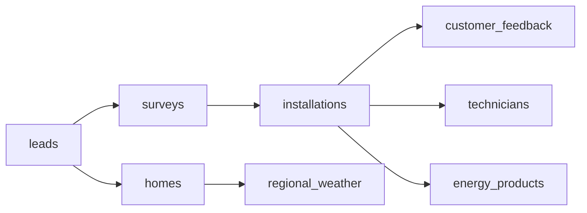

# HeatOps Analytics

HeatOps Analytics is a compact analytics engineering project for residential
energy installations. It models the path from customer lead to completed
installation, then turns that data into SQL marts, quality checks, KPI
definitions, and a dashboard for business users.

The project is intentionally small enough to run locally, but structured like an
analytics workflow: raw data, modeled tables, documented metrics, tests, and a
dashboard layer.

## What It Covers

- SQL models for funnel, installation, capacity, and regional performance
- DuckDB warehouse generated from reproducible sample data
- Data quality checks for dates, duplicates, missing values, and invalid metrics
- KPI dictionary with plain-language definitions
- Streamlit dashboard for stakeholder questions
- Pytest coverage for the data pipeline

## Project Structure

```text
heatops-analytics/
  analytics/
    models/          # staging SQL
    marts/           # business-facing SQL marts
    quality_checks/  # SQL checks returning failing rows
  dashboard/
    app.py           # Streamlit dashboard
  data/
    raw/             # generated CSV inputs
  docs/
    kpi_dictionary.md
    stakeholder_questions.md
  scripts/
    build_warehouse.py
    generate_sample_data.py
  tests/
```

## Quickstart

```bash
python3 -m venv .venv
source .venv/bin/activate
pip install -r requirements.txt

python scripts/generate_sample_data.py
python scripts/build_warehouse.py
pytest
streamlit run dashboard/app.py
```

The dashboard opens on `http://localhost:8501`.

## Example Business Questions

- Which region has the highest lead-to-installation conversion?
- Where are installations taking longer than expected?
- Which product line has the largest backlog?
- How much estimated annual CO2 reduction comes from completed projects?
- Which data quality issues should be fixed before weekly reporting?

## Main KPIs

- Lead-to-survey conversion
- Survey-to-installation conversion
- Median installation lead time
- Open installation backlog
- Estimated annual CO2 reduction
- Customer satisfaction score

## Data Model



## Notes

The data is synthetic and generated locally. The dashboard and metrics are meant
to show the shape of an analytics workflow, not to represent real operational
data.
